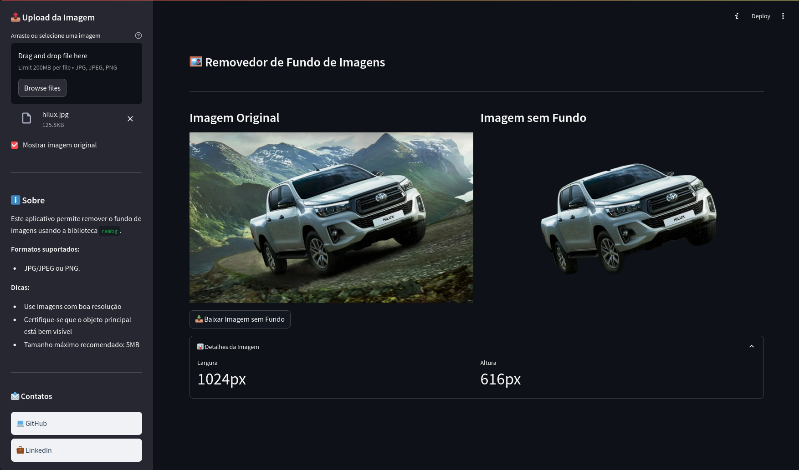

# 🖼️ Removedor de Fundo de Imagens


Este é um aplicativo web desenvolvido com Streamlit que permite remover o fundo de imagens utilizando a biblioteca `rembg`. O aplicativo suporta imagens nos formatos JPG, JPEG e PNG, e oferece a opção de baixar a imagem processada sem o fundo.

## 🚀 Como Usar

### Pré-requisitos

Antes de executar o aplicativo, certifique-se de ter o Python instalado em sua máquina. Além disso, você precisará instalar as dependências do projeto.

### Instalação

1. Clone este repositório:

   ```bash
   git clone https://github.com/esscova/removedor-de-fundo.git
   cd removedor-de-fundo
   ```

2. Crie um ambiente virtual (opcional, mas recomendado):

   ```bash
   python -m venv venv
   source venv/bin/activate  # No Windows, use `venv\Scripts\activate`
   ```

3. Instale as dependências:

   ```bash
   pip install -r requirements.txt
   ```

### Executando o Aplicativo

Após instalar as dependências, você pode executar o aplicativo com o seguinte comando:

```bash
streamlit run app.py
```

O aplicativo será iniciado e estará disponível no seu navegador em `http://localhost:8501`.

## 🛠️ Funcionalidades

- **Remoção de Fundo**: Remove o fundo de imagens nos formatos JPG, JPEG e PNG.
- **Visualização de Imagens**: Permite visualizar a imagem original e a imagem processada lado a lado.
- **Download da Imagem Processada**: Oferece a opção de baixar a imagem sem o fundo.
- **Detalhes da Imagem**: Exibe informações sobre a largura e altura da imagem processada.

## 📦 Dependências

O projeto utiliza as seguintes bibliotecas:

- `streamlit`: Para criar a interface web.
- `rembg`: Para remover o fundo das imagens.
- `Pillow (PIL)`: Para manipulação de imagens.
- `base64`: Para codificação de imagens em base64.

Você pode instalar todas as dependências usando o arquivo `requirements.txt`:

```bash
pip install -r requirements.txt
```

## 📝 Exemplo de Uso

1. Acesse o aplicativo no seu navegador.
2. Faça o upload de uma imagem clicando no botão de upload na barra lateral.
3. Aguarde o processamento da imagem.
4. Visualize a imagem original e a imagem sem fundo.
5. Baixe a imagem processada clicando no botão de download.

## 📞 Contato

Se você tiver alguma dúvida ou sugestão, sinta-se à vontade para entrar em contato:

- **GitHub**: [esscova](https://github.com/esscova)
- **LinkedIn**: [Wellington Moreira Santos](https://linkedin.com/in/wellington-moreira-santos)

## 📄 Licença

Este projeto está licenciado sob a licença MIT. Consulte o arquivo [LICENSE](LICENSE) para mais detalhes.

---

**Nota**: Este projeto foi desenvolvido como uma demonstração de uso da biblioteca `rembg` em conjunto com o Streamlit. Sinta-se à vontade para contribuir ou adaptá-lo conforme suas necessidades.

